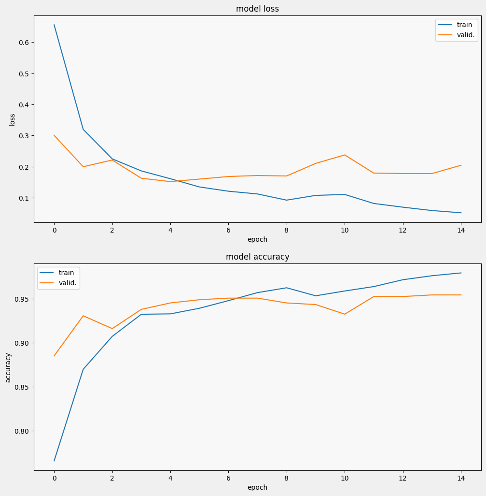

# Classification of Chest Radiography, CNNs and transfer learning models

### Project in Adv Machine Learning: assignment2_GRP4_yc4336

### Content

------------------------------------------------------------------------

-   [Introduction]

-   [Overview]

-   [Steps]

-   [Results]

-   [Conclusions]

-   [References]

### Introduction

------------------------------------------------------------------------

| Image recognition using deep learning have been prevalent in various industries. Recent real-world application in COVID-19 diagnosis have shed light on how this technique could have prompt deployment in healthcare industry. Any technological device that allows for swift and precise screening of COVID-19 infection could prove invaluable for healthcare providers. Currently, the primary clinical method utilized for diagnosing COVID-19 is Reverse Transcription Polymerase Chain Reaction (RT-PCR), which is costly, relatively less sensitive, and demands specialized medical personnel. X-ray imaging stands out as a readily available alternative that holds promise in COVID-19 diagnosis.
| 
| This project aim to replicate the the result with two approaches: self-trained CNNs and pre-trained transfer learning technique.

### Overview

------------------------------------------------------------------------

| The project uses the database organized and published by Muhammad E. H. Chowdhury et. al,.^1^ The database contains a mixture of 423 COVID-19, 1485 viral pneumonia, and 1579 normal chest X-ray images.
| Two self-trained CNN architectures were deployed, along with three pre-trained CNN architectures: `DenseNet201`^2^, `EfficientNetB7`^3^and `VGG16`^4^ (all trained on the ImageNet Dataset).
| All architectures were then fine-tuned on the dataset.
| The results obtained from the different architectures were then evaluted and compared.

### Steps

------------------------------------------------------------------------

| 1. Data exploration&prepossessing
| 1.1 Data Augmentation
| 2. Split the dataset
| 3. Fine-tune CNNs
| 3.1 Define a learning rate scheduler function, fit the CNN using call backs=learning rate scheduler
| 3.2 Set optimizer = Adam(learning_rate=0.001)

+---------------------+------------------------------------------------------------+
| Hyper-parameters    |                                                            |
+=====================+============================================================+
| Learning rate       | CNN1=`0.001`                                               |
|                     |                                                            |
|                     | CNN2 Decay the learning rate exponentially after 10 epochs |
+---------------------+------------------------------------------------------------+
| Batch Size          | `69`                                                       |
+---------------------+------------------------------------------------------------+
| Number of Epochs    | `15`                                                       |
+---------------------+------------------------------------------------------------+

| Loss Function               | Optimizer |
|-----------------------------|-----------|
| `Categorical Cross Entropy` | `Adam`    |

| 4. Fine-tune DenseNet201, EfficientNetB7 and VGG16
| 4.1 Steps:
| -The pretrained network is loaded without the final classifcation head.
| -Freeze the weights of the pretrained network.
| -Add new head layers to be trained.
| 

+---------------------+---------------------------------------------------------------------+
| Hyper-parameters    |                                                                     |
+=====================+=====================================================================+
| Learning rate       | Intial=`0.001`Decay the learning rate exponentially after 10 epochs |
+---------------------+---------------------------------------------------------------------+
| Batch Size          | `69`                                                                |
+---------------------+---------------------------------------------------------------------+
| Number of Epochs    | `15`                                                                |
+---------------------+---------------------------------------------------------------------+

| Loss Function               | Optimizer |
|-----------------------------|-----------|
| `Categorical Cross Entropy` | `Adam`    |

| Plot running losses & accuracies for each model

+-------------------------+-----------------------------------+
| Model                   | Plot                              |
+=========================+===================================+
| CNN1                    |           |
+-------------------------+-----------------------------------+
| CNN2                    |           |
+-------------------------+-----------------------------------+
| Densenet201             |  \|   |
|                         |                                   |
| Pre-trained on ImageNet |                                   |
+-------------------------+-----------------------------------+
| Efnet                   |  \|      |
|                         |                                   |
| Pre-trained on ImageNet |                                   |
+-------------------------+-----------------------------------+
| VGG                |            |
|                         |                                   |
| Pre-trained on ImageNet |                                   |
+-------------------------+-----------------------------------+

### Results

------------------------------------------------------------------------

### Conclusions

------------------------------------------------------------------------

-   Densenet121 and CNN2 were relatively better than CNN1, VGG16 and EfficientNetB7.
-   Parameter count increase doesn't necessarily achieve better results.
-   Learning rate scheduler could possibly lead to a faster convergence.
-   Batch noarmalization should be deployed with caustion.

### References

------------------------------------------------------------------------

| M.E.H. Chowdhury, T. Rahman, A. Khandakar, R. Mazhar, M.A. Kadir, Z.B. Mahbub, K.R. Islam, M.S. Khan, A. Iqbal, N. Al-Emadi, M.B.I. Reaz, “Can AI help in screening Viral and COVID-19 pneumonia?” arXiv preprint, 29 March 2020, [Link](https://colab.research.google.com/corgiredirector?site=https%3A%2F%2Farxiv.org%2Fabs%2F2003.13145)
| Gao Huang, Zhuang Liu, Laurens van der Maaten, Kilian Q. Weinberger,"Densely Connected Convolutional Networks",28 Jan 2018, [Link](https://arxiv.org/abs/1608.06993)
| Mingxing Tan, Quoc V. Le,"EfficientNet: Rethinking Model Scaling for Convolutional Neural Networks",11 Sep 2020, [Link](https://arxiv.org/abs/1905.11946)
| Karen Simonyan, Andrew Zisserman,"Very Deep Convolutional Networks for Large-Scale Image Recognition", 10 Apr 2015,[Link](https://arxiv.org/abs/1409.1556)
